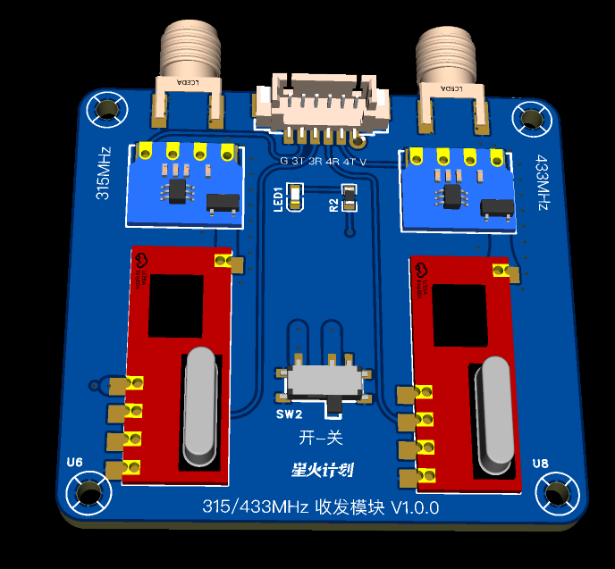

# ESP32 RF Module Library

ESP32 RF 收发模块库，支持 315MHz 和 433MHz 双频段 RF 信号收发。

本库专为 [xiaozhi-esp32](https://github.com/78/xiaozhi-esp32) 项目设计，集成了 MCP（Model Context Protocol）工具功能，支持通过 AI 对话控制 RF 信号收发。

## 功能特性

- ✅ 支持 315MHz 和 433MHz 双频段收发
- ✅ 信号发送和接收（中断方式）
- ✅ 信号捕获和重放
- ✅ 信号持久化存储（NVS Flash，最多10个信号）
- ✅ 信号列表和按索引发送
- ✅ 信号清理功能
- ✅ 协议配置（协议编号、脉冲长度、重复次数）
- ✅ MCP 工具集成（可选，需要 MCP Server）

## 硬件要求

### 外部拓展模块接口

外部拓展模块采用 6P 引脚接口：

| 引脚编号 | 名称 | 说明 | 对应功能 |
|---------|------|------|---------|
| 1 | G | 地线 | 公共地 |
| 2 | 3T | 315MHz 发送 | 315MHz 发射引脚 |
| 3 | 3R | 315MHz 接收 | 315MHz 接收引脚 |
| 4 | 4R | 433MHz 接收 | 433MHz 接收引脚 |
| 5 | 4T | 433MHz 发送 | 433MHz 发射引脚 |
| 6 | V | 电源 | 3.3V 供电 |

### 引脚配置

需要配置以下 4 个 GPIO 引脚：

- `RF_TX_315_PIN`: 315MHz 发送引脚
- `RF_RX_315_PIN`: 315MHz 接收引脚
- `RF_TX_433_PIN`: 433MHz 发送引脚
- `RF_RX_433_PIN`: 433MHz 接收引脚

## 硬件设计

本库配套的 PCB 设计已开源，可在立创开源广场查看和下载：

🔗 **[ESP32 RF 管理模块 PCB 设计](https://oshwhub.com/zhoushoujian/esp32-rf-management-system)**

### PCB 设计特点

- **双频段设计**：独立的 315MHz 和 433MHz RF 收发模块
- **6P 接口**：标准化的 6 引脚接口，方便集成到主控板
- **尺寸**：46.2mm × 42.2mm，紧凑设计
- **版本**：V1.0.0

### PCB 预览

#### PCB 布局图


> 📐 **PCB 布局特点**：
> - 左右对称设计，分别对应 315MHz 和 433MHz 频段
> - 每个频段包含独立的 RF 收发模块和天线连接器
> - 中央区域为 6P 接口和控制电路
> - 四角安装孔，方便固定安装
> - PCB 尺寸：46.2mm × 42.2mm

#### 3D 渲染图


> 🎨 **3D 视图说明**：
> - 蓝色 PCB 基板，表面贴装元件
> - 左右两侧分别为 315MHz 和 433MHz RF 模块
> - 顶部中央为 6P 接口（G, 3T, 3R, 4R, 4T, V）
> - 支持 SMA 天线接口（可选）

> 💡 **提示**：
> - PCB 设计文件、原理图和 BOM 清单均可在 [立创开源广场项目页面](https://oshwhub.com/zhoushoujian/esp32-rf-management-system) 下载
> - 支持嘉立创 EDA 直接打开和编辑
> - PCB 尺寸：46.2mm × 42.2mm，支持标准 6P 接口连接

## 安装

### 作为 ESP-IDF 组件

1. 在你的项目 `idf_component.yml` 中添加：

```yaml
dependencies:
  zhoushoujianwork/esp32-rf-module:
    git: https://github.com/zhoushoujianwork/esp32-rf-module.git
    version: ^1.0.0
```

2. 或者使用 Component Manager（需要先发布到组件注册表）：

```yaml
dependencies:
  zhoushoujianwork/esp32-rf-module: "^1.0.0"
```

## 配置

本库支持通过主项目的 Kconfig 系统进行功能配置。配置方式如下：

### 在主项目中配置

**快速开始**：可以参考本库提供的示例文件：
- `Kconfig.projbuild.example` - Kconfig 配置示例
- `CMakeLists.example.txt` - CMakeLists.txt 配置示例

在主项目的 `Kconfig.projbuild` 文件中添加以下配置：

```kconfig
menu "ESP32 RF Module Configuration"

    config RF_MODULE_ENABLE_FLASH_STORAGE
        bool "Enable Flash Storage (NVS)"
        default y
        help
            Enable NVS flash storage for signal persistence.
            When enabled, received signals are automatically saved to flash.
            Requires nvs_flash component.

    config RF_MODULE_MAX_FLASH_SIGNALS
        int "Maximum Flash Storage Signals"
        range 1 20
        default 10
        depends on RF_MODULE_ENABLE_FLASH_STORAGE
        help
            Maximum number of signals to store in flash storage.
            Uses circular buffer, oldest signals are overwritten when full.

    config RF_MODULE_ENABLE_433MHZ
        bool "Enable 433MHz Frequency Support"
        default y
        help
            Enable support for 433MHz RF signals.
            Requires RCSwitch component.

    config RF_MODULE_ENABLE_315MHZ
        bool "Enable 315MHz Frequency Support"
        default y
        help
            Enable support for 315MHz RF signals.
            Requires TCSwitch component.

    config RF_MODULE_ENABLE_MCP_TOOLS
        bool "Enable MCP Tools"
        default y
        depends on RF_MODULE_ENABLE_FLASH_STORAGE
        help
            Enable MCP (Model Context Protocol) tools integration.
            Provides self.rf.* tools for AI-driven device control.
            Requires mcp_server component from the main project.

    config RF_MODULE_LOG_LEVEL
        int "Log Level"
        range 0 5
        default 3
        help
            Set the log level for RF module:
            0 = None
            1 = Error
            2 = Warning
            3 = Info
            4 = Debug
            5 = Verbose

endmenu
```

然后在主项目的 `CMakeLists.txt` 中添加配置转换逻辑：

```cmake
# RF Module Configuration (from Kconfig to CMake)
if(CONFIG_RF_MODULE_ENABLE_FLASH_STORAGE)
    set(RF_MODULE_ENABLE_FLASH_STORAGE ON)
else()
    set(RF_MODULE_ENABLE_FLASH_STORAGE OFF)
endif()

if(CONFIG_RF_MODULE_ENABLE_433MHZ)
    set(RF_MODULE_ENABLE_433MHZ ON)
else()
    set(RF_MODULE_ENABLE_433MHZ OFF)
endif()

if(CONFIG_RF_MODULE_ENABLE_315MHZ)
    set(RF_MODULE_ENABLE_315MHZ ON)
else()
    set(RF_MODULE_ENABLE_315MHZ OFF)
endif()

if(CONFIG_RF_MODULE_ENABLE_MCP_TOOLS)
    set(RF_MODULE_ENABLE_MCP_TOOLS ON)
else()
    set(RF_MODULE_ENABLE_MCP_TOOLS OFF)
endif()

if(DEFINED CONFIG_RF_MODULE_MAX_FLASH_SIGNALS)
    set(RF_MODULE_MAX_FLASH_SIGNALS ${CONFIG_RF_MODULE_MAX_FLASH_SIGNALS})
endif()

if(DEFINED CONFIG_RF_MODULE_LOG_LEVEL)
    set(RF_MODULE_LOG_LEVEL ${CONFIG_RF_MODULE_LOG_LEVEL})
endif()
```

### 配置选项说明

- **Enable Flash Storage (NVS)** (`RF_MODULE_ENABLE_FLASH_STORAGE`)
  - 默认：启用
  - 启用 NVS 闪存存储功能，用于信号持久化

- **Maximum Flash Storage Signals** (`RF_MODULE_MAX_FLASH_SIGNALS`)
  - 默认：10
  - 范围：1-20
  - 闪存中最多保存的信号数量（循环缓冲区）

- **Enable 433MHz Frequency Support** (`RF_MODULE_ENABLE_433MHZ`)
  - 默认：启用
  - 启用 433MHz 频率支持

- **Enable 315MHz Frequency Support** (`RF_MODULE_ENABLE_315MHZ`)
  - 默认：启用
  - 启用 315MHz 频率支持

- **Enable MCP Tools** (`RF_MODULE_ENABLE_MCP_TOOLS`)
  - 默认：启用
  - 启用 MCP 工具集成（需要 Flash Storage 支持）
  - 如果禁用，`rf_mcp_tools.h` 将无法编译

- **Log Level** (`RF_MODULE_LOG_LEVEL`)
  - 默认：3 (Info)
  - 范围：0-5
  - 设置日志级别（0=None, 1=Error, 2=Warning, 3=Info, 4=Debug, 5=Verbose）

### 配置示例

运行 `idf.py menuconfig`，进入主项目的配置菜单，找到 `ESP32 RF Module Configuration` 进行配置。

如果只需要 433MHz 支持，可以禁用 315MHz：

```
ESP32 RF Module Configuration
  [*] Enable Flash Storage (NVS)
  [*] Enable 433MHz Frequency Support
  [ ] Enable 315MHz Frequency Support
  [*] Enable MCP Tools
```

如果不需要 MCP 工具，可以禁用：

```
ESP32 RF Module Configuration
  [*] Enable Flash Storage (NVS)
  [ ] Enable MCP Tools
```

**注意**：
- 禁用功能后，相关代码会被条件编译排除，减少代码体积
- 所有配置项都有默认值，保持向后兼容性
- 如果主项目未配置 Kconfig，组件将使用默认配置（所有功能启用）

## 使用方法

### 基本使用

```cpp
#include "rf_module.h"

// 初始化 RF 模块
RFModule rf_module(
    RF_TX_433_PIN, RF_RX_433_PIN,  // 433MHz 引脚
    RF_TX_315_PIN, RF_RX_315_PIN   // 315MHz 引脚
);

rf_module.Begin();

// 发送信号
rf_module.Send("A1B2C3", "01", RF_433MHZ);

// 接收信号
if (rf_module.ReceiveAvailable()) {
    RFSignal signal;
    if (rf_module.Receive(signal)) {
        // 处理接收到的信号
        ESP_LOGI("RF", "Received: %s%s (%sMHz)", 
                 signal.address.c_str(), signal.key.c_str(),
                 signal.frequency == RF_315MHZ ? "315" : "433");
    }
}

rf_module.End();
```

### MCP 工具集成（可选）

本库专为 [xiaozhi-esp32](https://github.com/78/xiaozhi-esp32) 项目设计，集成了完整的 MCP（Model Context Protocol）工具功能。

xiaozhi-esp32 是一个基于 MCP 协议的 AI 聊天机器人项目，支持通过语音对话控制各种 IoT 设备。本库的 MCP 工具集成使得用户可以通过自然语言与 AI 对话来控制 RF 信号收发。

#### 在 xiaozhi-esp32 项目中使用

如果你的项目基于 xiaozhi-esp32，可以使用 `rf_mcp_tools.h` 注册 MCP 工具：

```cpp
#include "rf_mcp_tools.h"
#include "mcp_server.h"  // xiaozhi-esp32 项目提供

// 在板子初始化时注册 MCP 工具
void RegisterMcpTools() {
    if (rf_module_) {
        RegisterRFMcpTools(rf_module_);
    }
}
```

注册后，AI 可以通过自然语言控制 RF 模块，例如：
- "帮我发送一个433MHz信号，地址A1B2C3，按键01"
- "复制一下这个遥控器的信号"
- "列出所有保存的信号"
- "发送第3个信号"

#### MCP 工具列表

本库提供以下 MCP 工具（通过 `RegisterRFMcpTools()` 注册）：

1. **self.rf.send** - 发送 RF 信号
2. **self.rf.receive** - 接收 RF 信号（阻塞等待）
3. **self.rf.replay** - 重播最后接收的信号
4. **self.rf.capture** - 捕捉模式
5. **self.rf.list_signals** - 列出所有保存的信号
6. **self.rf.send_by_index** - 按索引发送信号
7. **self.rf.clear_signals** - 清理保存的信号
8. **self.rf.get_status** - 获取模块状态
9. **self.rf.set_config** - 配置模块参数

**注意**：`rf_mcp_tools.h` 依赖 xiaozhi-esp32 项目中的 MCP Server 实现。如果你的项目不使用 MCP 协议，可以只使用核心功能（`rf_module.h`），忽略 MCP 工具文件。

## API 文档

### RFModule 类

#### 初始化

```cpp
RFModule(gpio_num_t tx433_pin, gpio_num_t rx433_pin,
         gpio_num_t tx315_pin, gpio_num_t rx315_pin);
void Begin();
void End();
```

#### 发送信号

```cpp
void Send(const std::string& address, const std::string& key, RFFrequency freq = RF_433MHZ);
void Send(const RFSignal& signal);
```

#### 接收信号

```cpp
bool ReceiveAvailable();
bool Receive(RFSignal& signal);
```

#### 配置

```cpp
void SetRepeatCount(uint8_t count, RFFrequency freq = RF_433MHZ);
void SetProtocol(uint8_t protocol, RFFrequency freq = RF_433MHZ);
void SetPulseLength(uint16_t pulse_length, RFFrequency freq = RF_433MHZ);
```

#### 信号存储

```cpp
void EnableFlashStorage(const char* namespace_name = "rf_replay");
bool SaveToFlash();
bool LoadFromFlash();
void ClearFlash();
uint8_t GetFlashSignalCount() const;
bool GetFlashSignal(uint8_t index, RFSignal& signal) const;
```

### RFSignal 结构体

```cpp
struct RFSignal {
    std::string address;      // 6位十六进制地址码
    std::string key;          // 2位十六进制按键值
    RFFrequency frequency;    // 频率类型（315MHz 或 433MHz）
    uint8_t protocol;        // 协议编号
    uint16_t pulse_length;    // 脉冲长度（微秒）
};
```

## 信号格式

RF 信号采用 24 位编码格式：
- 前 6 位十六进制：地址码（address）
- 后 2 位十六进制：按键值（key）

例如：`address="A1B2C3"`, `key="01"` 表示地址码为 A1B2C3，按键值为 01。

## 协议支持

- **RCSwitch**：433MHz 协议处理（移植自 Arduino RCSwitch 库）
- **TCSwitch**：315MHz 协议处理（移植自 Arduino TCSwitch 库）

## 依赖

- ESP-IDF >= 5.4.0
- nvs_flash（用于信号持久化存储）

## 目录结构

```
esp32-rf-module/
├── CMakeLists.txt              # ESP-IDF 组件构建配置
├── idf_component.yml           # Component Manager 清单文件
├── README.md                   # 库文档
├── LICENSE                     # MIT 许可证
├── Kconfig.projbuild.example   # 主项目 Kconfig 配置示例
├── CMakeLists.example.txt      # 主项目 CMakeLists.txt 配置示例
├── include/                    # 公共头文件目录
│   ├── rf_module_config.h      # 配置头文件（默认值）
│   ├── rf_module.h            # RF 模块核心类
│   ├── rcswitch.h             # 433MHz 协议处理
│   ├── tcswitch.h             # 315MHz 协议处理
│   └── rf_mcp_tools.h         # MCP 工具注册函数（可选）
└── src/                       # 源文件目录
    ├── rf_module.cc
    ├── rcswitch.cc
    └── tcswitch.cc
```

## 文件说明

- **核心功能**（必需）：
  - `include/rf_module.h` + `src/rf_module.cc`: RF 模块核心类
  - `include/rcswitch.h` + `src/rcswitch.cc`: 433MHz 协议处理
  - `include/tcswitch.h` + `src/tcswitch.cc`: 315MHz 协议处理

- **MCP 工具集成**（可选，需要 MCP Server）：
  - `include/rf_mcp_tools.h`: MCP 工具注册函数，用于小智 AI 对话集成

## 相关项目

本库专为 [xiaozhi-esp32](https://github.com/78/xiaozhi-esp32) 项目设计。

xiaozhi-esp32 是一个基于 MCP（Model Context Protocol）协议的 AI 聊天机器人项目，支持：
- 离线语音唤醒（ESP-SR）
- 流式 ASR + LLM + TTS 语音交互
- 设备端 MCP 协议控制（扬声器、LED、舵机、GPIO、RF 等）
- 云端 MCP 扩展大模型能力（智能家居控制、PC 桌面操作、知识搜索等）

通过本库的 MCP 工具集成，xiaozhi-esp32 用户可以：
- 通过自然语言与 AI 对话控制 RF 信号收发
- 复制/克隆遥控器信号
- 管理保存的 RF 信号
- 通过语音指令发送 RF 信号

## 许可证

MIT License

Copyright (c) 2025 Shenzhen Xinzhi Future Technology Co., Ltd.
Copyright (c) 2025 Project Contributors

## 贡献

欢迎提交 Issue 和 Pull Request！

## 更新日志

### v0.1.6
- **文档更新**：添加立创开源广场 PCB 设计链接和图片
- 添加 PCB 布局图和 3D 渲染图预览
- 完善硬件设计说明文档

### v0.1.5
- **修复**：修复 CMakeLists.txt 中 `add_compile_definitions` 命令在 ESP-IDF 组件构建阶段不可用的问题
- 将编译定义设置改为使用 `target_compile_definitions`，并在 `idf_component_register` 之后调用
- 确保与 ESP-IDF 5.4+ 的兼容性

### v0.1.4
- **重大变更**：移除组件内部的 Kconfig 配置，改为通过主项目的 Kconfig.projbuild 配置
- 解决组件库 Kconfig 导致的构建问题
- 添加 `rf_module_config.h` 配置头文件，提供默认值
- 添加配置示例文件（`Kconfig.projbuild.example` 和 `CMakeLists.example.txt`）
- 保持向后兼容性，所有功能默认启用

### v0.1.3
- 初始版本
- 支持 315MHz 和 433MHz 双频段收发
- 支持信号捕获和重放
- 支持信号持久化存储
- 支持 MCP 工具集成（可选）
